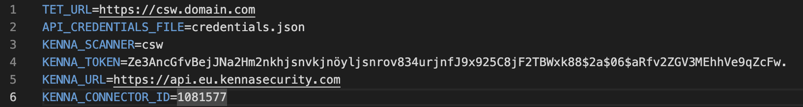
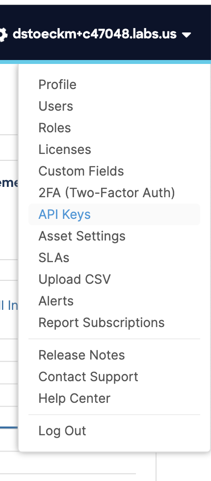

# CSW-to-Kenna

This simple Python script to pull Vulnerabilities out of Cisco Secure Workload,format into JSON and upload to a preconfigured Cisco Vulnerability Management Connector.

This python code relies on the requiremet.txt, please intall acordingly by `pip install -r /path/to/requirements.txt`

Than you need to copy the .env_sample file into .env and edit like below.

You will find your Cisco Secure Workload API key in the user section of the UI, top right.

 

The same works for Cisco Vulnerability Management

The result should look like this

Change the credentials-sample.json firl to credentials.json and edit your API key.